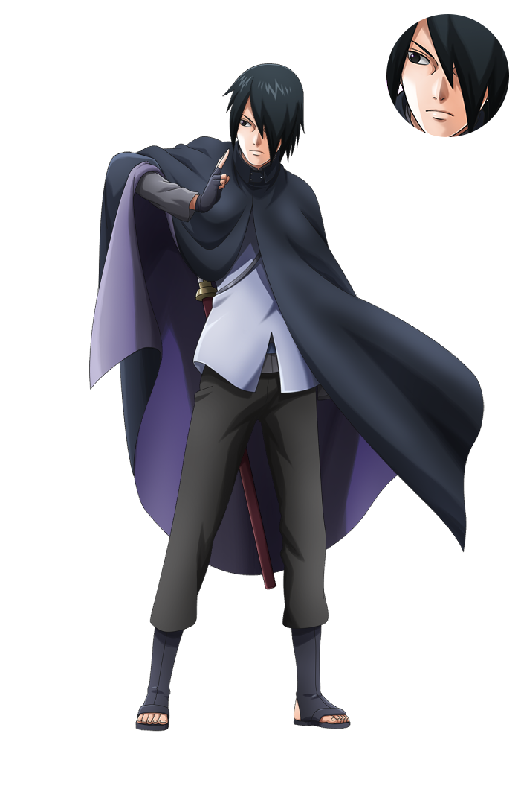

  

<h2 align="center">
  NxB NV Progress: Personal Data
</h2>

Disclaimer: It won't be of any interest to anyone else. If you are here and not me, you have landed on the wrong place.

Last updated: July 31, 2022.

  <b>Player Name</b>: Ronasaurus

  <b>All-Time Best Rank</b>: Gokunin (x3)

<table align="center">
  <tr align="center">
    <th colspan="2">Attack Missions (AM) Stats: Attacks</th>
  </tr>
  <tr align="center">
    <td>Wins</td>
    <td>Losses</td>
  </tr>
  <tr align="center">
    <td>2313</td>
    <td>163</td>
  </tr>
</table>

  <b>Current (Solo) Main Shinobi</b>: <a href="images/wn-sasuke.png">Sasuke Uchiha (Wandering Ninja)</a>

<table align="center">
  <tr align="center">
    <th colspan="4">List of Main Shinobi in AM</th>
  </tr>
  <tr align="center">
    <td>Term</td>
    <td>Shinobi</td>
    <td>Missions</td>
    <td>Wins</td>
  <tr/>
  <tr>
    <td>07.22-now</td>
    <td><a href="shinobi/anbu-itachi">Itachi Uchiha (Anbu)</a> *</td>
    <td align="center">16</td>
    <td align="center">(15)</td>
  </tr>
  <tr>
    <td>05.22-now</td>
    <td><a href="shinobi/wn-sasuke">Sasuke Uchiha (Wandering Ninja)</a></td>
    <td align="center">1558</td>
    <td align="center">(1496)</td>
  </tr>
  <tr>
    <td>06.21-08.21</td>
    <td><a href="shinobi/hokage-naruto">Naruto Uzumaki (7th Hokage)</ta>
    <td align="center">902</td>
    <td align="center">(802)</td>
  </tr>
  <tr>
    <td colspan="4">* deputy (solo) main, plays at least 30% of AM games in their term</td>
  </tr>
</table>

<!-- AM Main Stats
Sasuke Uchiha (Wandering Ninja):
Naruto Uzumaki (7th Hokage): 800 wins, 100 losses
-->

### :muscle: Shinobi Strength

The tier list is [here](https://www.reddit.com/r/ninjavoltage/wiki/tierlist/). The following suffixes should be kept in mind.
 
- :boom:: is a special shinobi trained for AOM
- :european_castle:: has duties on fortress
- :cyclone:: is the (solo) main in attack missions

#### 

- [Sasuke Uchiha (Wandering Ninja)](images/wn-sasuke) 💥 🏰 🌀
- [Minato Namikaze (Reanimation Kurama Link Mode)](images/minato-klm) 💥
- [Itachi Uchiha (Reanimation)](images/itachi-edo) 💥
- [Naruto Uzumaki (Six Paths Sage Mode: Light)](images/naruto-light) 💥 🏰
- [Madara Uchiha (Reanimation)]() 💥
- [Obito Uchiha (Illusionary World Outfit)]() 💥
- [Kawaki]()
- [Boruto Uzumaki (Genin)]()
- [Naruto Uzumaki (Sage Mode)]()
- [Mei Terumi]()

#### 

- [Tsunade (Great Ninja War)]() 💥
- [Minato Namikaze (Reanimation)]() 💥
- [Kimimaro (Reanimation)]() :boom:
- [Sasuke Uchiha (The Final Showdown)]()
- [Madara Uchiha (Six Paths)]()

#### 

- [Indra Otsutsuki]() :boom: 🏰
- [Itachi Uchiha (Anbu)]() 💥 🏰
- [Sasuke Uchiha (Warrior Spirit)]() 💥
- [Hinata Hyuga (Summer Break)]() 💥
- [Kabuto Yakushi (Sage Mode)]() 💥
- [Obito Uchiha]()
- [Sakura Haruno (Summer Break)]() 💥
- [Pain (Tendo)]()
- [Raikage Ay]()

#### 

- [Naruto Uzumaki (7th Hokage)]() 💥 🏰
- [Jiraiya]() 💥
- [Gaara (Allied Shinobi Forces Commander)]() 💥
- [Boruto Uzumaki (Warrior Spirit)]() 💥
- [Boruto Uzumaki (Karma)]()
- [Hashirama Senju]() :european_castle:
- [Itachi Uchiha (VS Sasuke)]()
- [Sasuke Uchiha (Eternal Mangekyo Sharingan)]()
- [Nagato (Reanimation)]()

#### 

- [Naruto Uzumaki (Kurama Link Mode)]() 💥 🏰
- [Hashirama Senju (Reanimated Sage Mode)]() 💥
- [Konan (Summer Break)]() 💥
- [Ashura Otsutsuki]() 🏰
- [Tsunade]()
- [Sakura Haruno (Great Ninja War)]()
- [Shisui Uchiha]() 💥
- [Sakura Uchiha]()
- [Kushina Uzumaki]()
- [Sasuke Uchiha (Rinne Sharingan)]()
